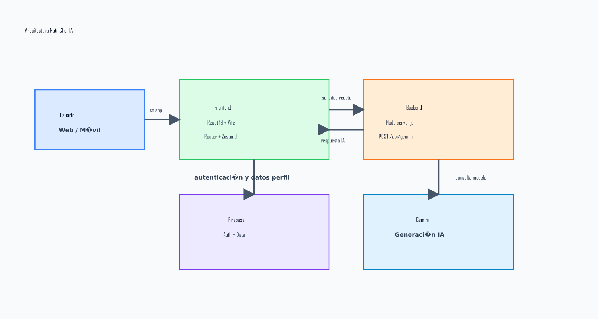
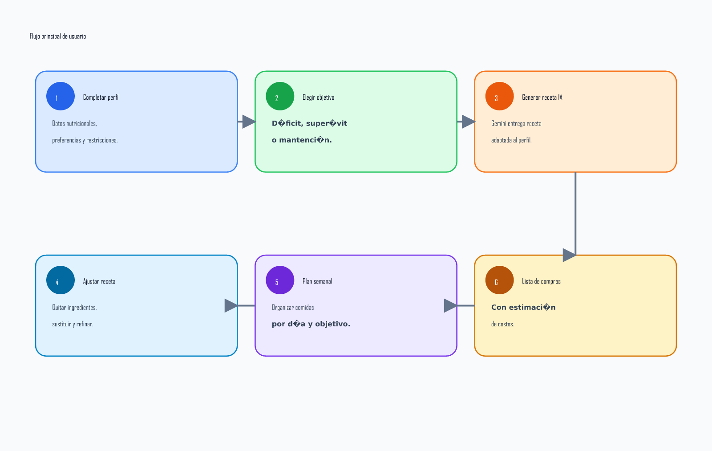
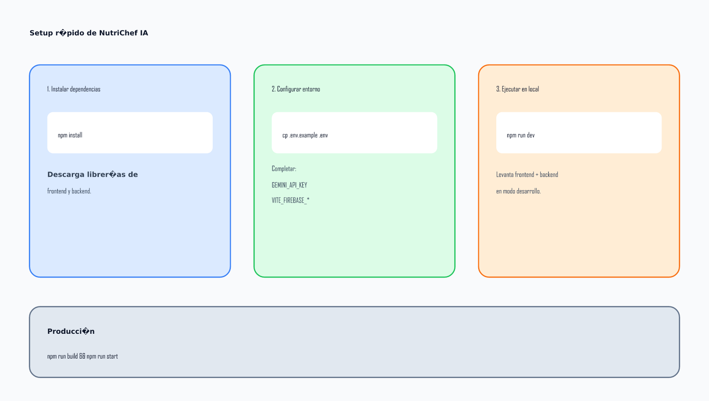

# NutriChef IA


Aplicación web para generar recetas, planes de comida y listas de compra personalizadas con apoyo de IA, considerando objetivos nutricionales, restricciones alimentarias, presupuesto y contexto local.

## Diagramas explicativos

### Arquitectura general



### Flujo principal de usuario



### Setup rápido



## Funcionalidades principales

- Generación de recetas personalizadas desde ingredientes, preferencias y objetivos.
- Ajuste de recetas con lenguaje natural (reemplazos, exclusiones, refinamientos).
- Planificación de comidas (diaria/semanal) y sugerencias adaptadas al perfil.
- Lista de compras con estimación de costos por país/moneda.
- Soporte para restricciones dietarias (alergias, estilos alimentarios, Kosher/Halal, Pésaj, etc.).
- Autenticación y persistencia de datos con Firebase.

## Stack técnico

- **Frontend:** React 19, React Router, Zustand, TailwindCSS, Vite.
- **Backend:** Node.js (`server.js`) con servidor HTTP nativo.
- **IA:** Proxy a Gemini vía endpoint interno `POST /api/gemini`.
- **Datos/Auth:** Firebase + Firebase Admin.

## Requisitos previos

- Node.js 18+ (recomendado LTS reciente)
- npm 9+
- Proyecto/configuración Firebase (si usarás login y persistencia)
- API key de Gemini

## Instalación

```bash
npm install
cp .env.example .env
```

Completa luego tu `.env` con los valores necesarios.

## Configuración de entorno

Variables base en `.env.example`:

- `PORT`: puerto del backend (por defecto `8787`)
- `GEMINI_API_KEY`: clave Gemini en servidor
- `VITE_GEMINI_API_KEY`: fallback para cliente/servidor
- `VITE_FIREBASE_API_KEY`
- `VITE_FIREBASE_AUTH_DOMAIN`
- `VITE_FIREBASE_PROJECT_ID`
- `VITE_FIREBASE_STORAGE_BUCKET`
- `VITE_FIREBASE_MESSAGING_SENDER_ID`
- `VITE_FIREBASE_APP_ID`

## Ejecución en desarrollo

### Opción recomendada (cliente + servidor)

```bash
npm run dev
```

Este script levanta:

- backend (`node server.js`)
- frontend (`vite`)

### Ejecutar por separado

```bash
npm run dev:server
npm run dev:client
```

## Build y producción

```bash
npm run build
npm run start
```

- `build` genera `dist/`
- `start` sirve estáticos desde `dist/` y mantiene activo el endpoint `POST /api/gemini`

## Scripts disponibles

- `npm run dev`: servidor y cliente en paralelo
- `npm run dev:client`: solo Vite
- `npm run dev:server`: solo backend Node
- `npm run build`: build de producción
- `npm run preview`: vista previa del build con Vite
- `npm run start`: servidor de producción
- `npm run lint`: lint del proyecto

## Estructura del proyecto

```txt
nutrichef-app/
  src/                # App React (views, hooks, stores, context, componentes)
  scripts/            # Scripts utilitarios (ej: dev runner)
  public/             # Assets estáticos
  api/                # Recursos/API auxiliares del proyecto
  server.js           # Backend HTTP + proxy Gemini + static hosting
  .env.example        # Plantilla de variables de entorno
```

## Flujo funcional (alto nivel)

1. El frontend prepara prompts y payload estructurado según perfil del usuario.
2. Envía solicitudes a `POST /api/gemini`.
3. El backend valida la request, invoca Gemini y maneja errores/reintentos.
4. La respuesta vuelve al cliente para renderizar recetas, planes o listas.

## Troubleshooting rápido

- **Error de Gemini / cuota:** revisa `GEMINI_API_KEY` y límites de la cuenta.
- **No carga la app en producción:** ejecuta `npm run build` antes de `npm run start`.
- **Problemas de login/datos:** verifica variables `VITE_FIREBASE_*`.
- **Puerto ocupado:** cambia `PORT` en `.env`.

## Estado del proyecto

Proyecto en evolución activa. La arquitectura y funcionalidades pueden seguir iterando mientras se estabiliza la experiencia de generación nutricional y planificación.
